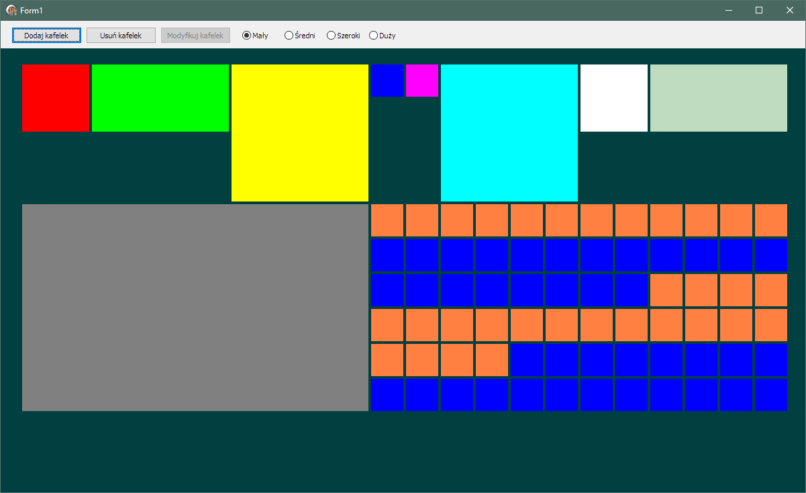
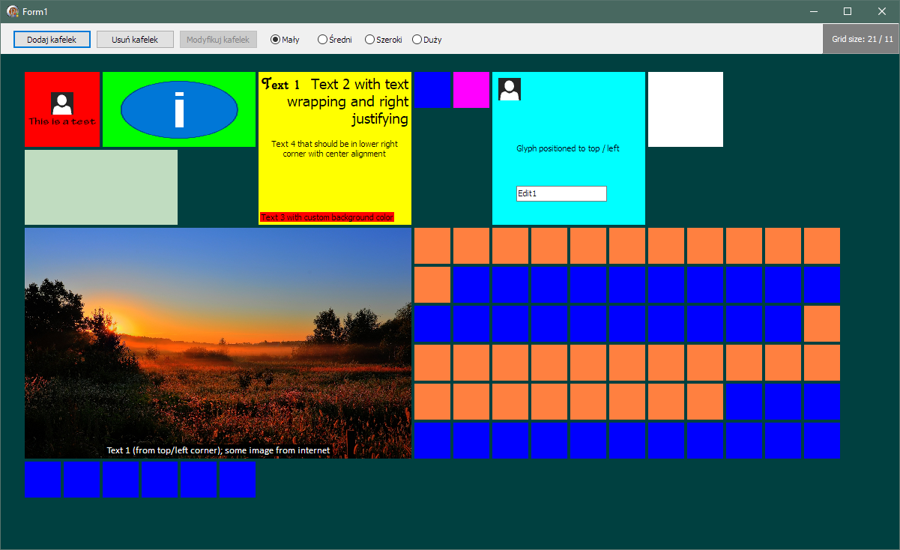

# TilesBoxControl
Delphi 2010+ Windows 10 like Tiles Box Control VCL Component

https://github.com/gmnevton/TilesBoxControl

```
  (c) Copyrights 2017-2018 Grzegorz Molenda aka NevTon <gmnevton@gmail.com>
  
  This software source is free and can be used for any needs. 
  The introduction of any changes and the use of those changed sources is permitted without limitations. 
  Only requirement: This README text must be present without changes in all modifications of sources.
```  

  > The contents of this file are used with permission, 
  > subject to the Mozilla Public License Version 2.0 (the "License"). 
  > You may not use this file except in compliance with the License. 
  > You may obtain a copy of the License at http: https://www.mozilla.org/en-US/MPL/2.0/

  > Software distributed under the License is distributed on an "AS IS" basis, 
  > WITHOUT WARRANTY OF ANY KIND, either express or implied. 
  > See the License for the specific language governing rights and limitations under the License.

-----

This is pre-alfa stage of construction.

### Concepts:
  - [x] make TScrollBox-like visual component: TTilesBoxControl, 
    that can accept other controls (of one acceptable type: TCustomTileControl),
  - [x] implement auto positioning of tiles,
  - [ ] implement manual positioning of tiles,
  - tiles can have:
    - [x] changable background,
    - [x] glyph that can be positioned and sized,
    - [x] caption, that can be displayed in connection with glyph,
    - [x] 4 corners texts, that can be positioned anywhere, customized,
    - [x] other visual components on them,
    - [x] 4 defined sizes (Small, Regular, Large, ExtraLarge),
    - [x] custom size defined by SizeCustomCols / SizeCustomRows fields, that can be set to Fixed.
  - [x] whole component is grid based (auto-calculated).




